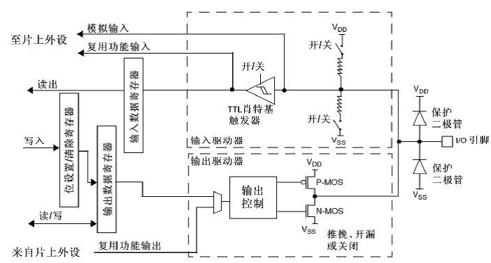
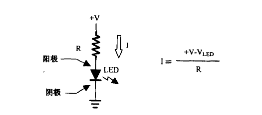
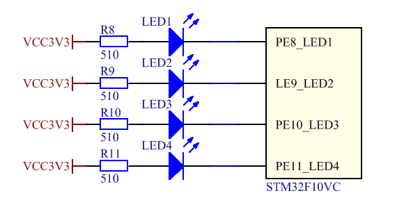
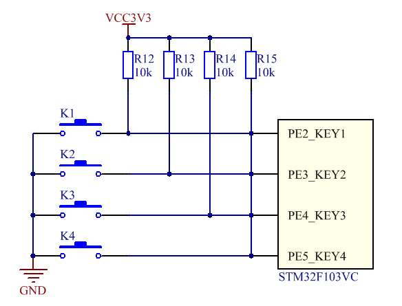
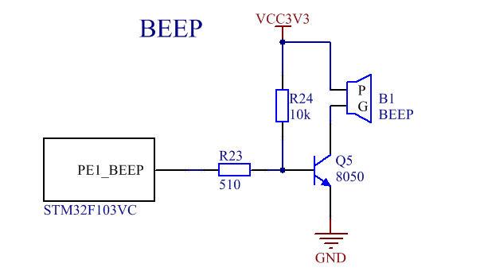

# 开关量
&emsp;&emsp;在嵌入式系统中的都会不同的方式将系统运行状态传送给用户，LED可以说是嵌入式系统中最简单的方式之一，本章简单介绍如何设计LED接口电路，对比应用操作系统与不用的异同。

&emsp;&emsp;本节主要目的介绍有无操作系统程序实现细节的差别。
在本章中以LED显示为例介绍RT-Thread操作系统线程管理相关的内容，并给出线程设计模型，以供设计者使用

&emsp;&emsp;书中所用开发套件关于开关量有三个外设可以进行演示，分类是LED、蜂鸣器、键盘。

## STM32 IO硬件介绍
&emsp;&emsp;STM32F系统处理器GPIO随着型号不同个数也不经相同 。以STM32F103VC 100引脚的为例,在100个引脚中除电源，时钟，模拟电路输入参考源之外所有的80个引脚均可配置成为不同的模式进行工作。
&emsp;&emsp;在STM32中每个脚可通过配置成不同的模式，进行功能在图 3 3 GPIO端口位的基本结构中表明每个引脚/端口输入输出中可选配置选项。可以通过配置寄存器行设置，比较繁琐，在ST官方提供的库中已对各功能进行划分，在库中以宏定义的形式给出。下面进行介绍。




**GPIO主要特性**

+ 输出状态可选推挽、开漏、上拉/下拉
+ 每个I/O速度可配置
+ 输入状态可选悬空、上位/下拉、模拟

&emsp;&emsp;输入浮空、输入上拉、输入下拉、模拟输入、开漏输出、推挽式输出、推挽式复用功能、开漏复用功能；工作模式GPIO_Mode在STM32库中以枚举型定义如下：
~~~{.c}
/* stm32f10x_gpio.h */
typedef enum
{ 
	GPIO_Mode_AIN = 0x00,         //模拟输入
	GPIO_Mode_IN_FLOATING = 0x04, //浮空输入
	GPIO_Mode_IPD = 0x28,         //下拉输入
    GPIO_Mode_IPU = 0x48,         //上拉输入
    GPIO_Mode_Out_OD = 0x14,      //开漏输出
    GPIO_Mode_Out_PP = 0x10,      //推挽式输出
    GPIO_Mode_AF_OD = 0x1C,       //推挽式复用功能
    GPIO_Mode_AF_PP = 0x18        //开漏复用功能
}GPIOMode_TypeDef;
~~~
&emsp;&emsp;GPIO最大输出速度根据需要可配置为2M、10M、50M进行工作，最大输出速度在STM32库中以枚举型定义如下：
~~~{.c}
/* stm32f10x_gpio.h */
typedef enum
{ 
    GPIO_Speed_10MHz = 1,
    GPIO_Speed_2MHz, 
    GPIO_Speed_50MHz
}GPIOSpeed_TypeDef;

~~~
## 外围器件介绍

### LED基本知识

&emsp;&emsp;发光二极管（Light Emitting Diode），是一种能够将电能转化为可见光的固态半导休器件，当电流流过LED时就会产生可视的光，LED的发光强度与通过LED的电流成正比如图5-1所示。目前常用的LED有红色、黄色、蓝色等。


### LED电路介绍
&emsp;&emsp;LED电路连接图如下所示，四个LED分别连接到STM32F103的PE8、PE9、PE10和PE11引脚，并通过510欧姆的电阻进行限流。


### 按键 ###
&emsp;&emsp;按键即开关，指一个可以使电路开路，使电流中断的电子元件，
### 按键电路介绍 ###
&emsp;&emsp;开发套件配有四个按键，分别连接到STM32F103的PE2、PE3、PE4和PE5引脚，并通过10K电阻进行上拉，在设计中，上位电阻可以省去，不过在编程时得把对应引脚软件配置为内部上拉


### 蜂鸣器介绍 ###

&emsp;&emsp;蜂鸣器是一种一体化结构的电子讯响器，采用直流电压供电，广泛应用于计算机、打印机、复印机、报警器、电子玩具、汽车电子设备、电话机、定时器等电子产品中作发声器件。蜂鸣器主要分为压电式蜂鸣器和电磁式蜂鸣器两种类型。要求

### 蜂鸣器电路介绍 ###
&emsp;&emsp;开发套件中配有一个有源蜂鸣器，与STM32F103的PE1连接。并通过三极管进行驱动。
 


## GPIO硬件相关函数
**GPIO引脚初始化**
```c
    /* stm32f10x_gpio.c */
    void GPIO_Init(GPIO_TypeDef* GPIOx, GPIO_InitTypeDef* GPIO_InitStruct)
```

&emsp;&emsp;根据GPIO_InitStruct中指定的参数进行初始化外设GPIOx寄存器。

-------------------------------------------------
    参数                  描述
---------            -------------------------------    
    GPIOx               通过x来选择GPIO外设,如GPIOA、GPIOE等
    GPIO_InitStruct 	指向结构GPIO_InitTypeDef的指针，包含外设GPIO的配置信息中可以指定引脚、GPIO工作速度和工作模式。
------------------------------------------------
**返回值**     无

**范例**
~~~
/* rt_hw_led.c */
void rt_hw_led_init(void)
{
    GPIO_InitTypeDef GPIO_InitStructure;
  
    RCC_APB2PeriphClockCmd(RCC_APB2Periph_GPIOE,ENABLE);
    
    GPIO_InitStructure.GPIO_Pin   = GPIO_Pin_8| GPIO_Pin_9| GPIO_Pin_10| GPIO_Pin_11;
    GPIO_InitStructure.GPIO_Mode  = GPIO_Mode_Out_PP;
    GPIO_InitStructure.GPIO_Speed = GPIO_Speed_50MHz;
    
    GPIO_Init(led1_gpio, &GPIO_InitStructure);
}
```
&emsp;&emsp;注：引脚选中是通过`GPIO_Pin_x`选定，选定多个`GPIO_Pin_8|GPIO_Pin_9`表示指定第5位和每六位，`x`可为`0`到`15`
 

**GPIO置位操作**
```c
/* stm32f10x_gpio.c */
void GPIO_SetBits(GPIO_TypeDef* GPIOx, uint16_t GPIO_Pin)
```
**功能：** 
&emsp;&emsp;对指定位进行置位操作。

--------------------------
	参数			描述
----------------------------
	GPIOx		通过x来选择GPIO外设,如GPIOA、GPIOE等；
	GPIO_Pin	指定需要置位的位，如GPIO_Pin_10 | GPIO_Pin_15选定10和他5引脚。
------------------------
**返回值:**     无

**范例**
```c
/* rt_hw_led.c */
void rt_hw_led_off(u8 n)
{

    GPIO_SetBits(GPIOE, GPIO_Pin_8);	//led1 = 1
  
}
```
**GPIO清零操作**
```c
/* stm32f10x_gpio.c */
void GPIO_ResetBits(GPIO_TypeDef* GPIOx, uint16_t GPIO_Pin)
```
**功能：**
&emsp;&emsp;对指定位进行清零操作。

----------------
	参数			描述
--------------------------------------
	GPIOx		通过x来选择GPIO外设,如GPIOA、GPIOE等；
	GPIO_Pin	指定需要置位的位，如GPIO_Pin_10 | GPIO_Pin_15选定10和15引脚。
---------------------------
	
**返回值**
&emsp;&emsp;无

**范例**
```c
/* rt_hw_led.c */
void rt_hw_led_on(rt_uint32_t n)
{
    .
    GPIO_ResetBits(GPIOE, GPIO_Pin_8);	//led1 = 0
    .
}
```

## 驱动模型
&emsp;&emsp;下图显示了led模块的程序接口，给应用程序提供3个接口函数，`led_init()、led_on()、led_off()`分别实现对led1、led2、led3、led4的初始化和led点亮和熄灭操作。

&emsp;&emsp;`rt_hw_led_init()`完成对led1、led2、led3、led4硬件的初始化；在实例中，应用应用到了STM32的GPIO功能，所以在初始化过程中首先要将GPIOE的时钟进行使能。

```c
/* rt_hw_led.c */
void rt_hw_led_init(void)
{
    GPIO_InitTypeDef GPIO_InitStructure;
  
    RCC_APB2PeriphClockCmd(RCC_APB2Periph_GPIOE,ENABLE);

    GPIO_InitStructure.GPIO_Mode  = GPIO_Mode_Out_PP;
    GPIO_InitStructure.GPIO_Speed = GPIO_Speed_50MHz;
    /* led1 */
    GPIO_InitStructure.GPIO_Pin   = GPIO_Pin_8;
    GPIO_Init(GPIOE, &GPIO_InitStructure);
    /* led2 */
    GPIO_InitStructure.GPIO_Pin   = GPIO_Pin_9;
    GPIO_Init(GPIOE, &GPIO_InitStructure);
    /* led3 */
    GPIO_InitStructure.GPIO_Pin   = GPIO_Pin_10;
    GPIO_Init(GPIOE, &GPIO_InitStructure);
    /* led4 */
    GPIO_InitStructure.GPIO_Pin   = GPIO_Pin_11;
    GPIO_Init(GPIOE, &GPIO_InitStructure);
}
```
&emsp;&emsp;在电路图中可以看到当LED对应引脚为低电平时led点亮，抽象出`rt_hw_led_on()`函数实现，输入参数为1、2、3、4分别点亮led1、led2、led3、led4。
```c
/* rt_hw_led.c */
void rt_hw_led_on(rt_uint32_t n)
{
    switch (n)
    {
    case 1:
        GPIO_SetBits(led1_gpio, led1_pin);
        break;
    case 2:
        GPIO_SetBits(led2_gpio, led2_pin);
        break;
    case 3:
        GPIO_SetBits(led3_gpio, led3_pin);
        break;
    case 4:
        GPIO_SetBits(led4_gpio, led4_pin);
        break;
    default:
        break;
    }
}
```
&emsp;&emsp;当STM32引脚为高电平时led熄灭，抽象出`rt_hw_led_off()`函数实现，输入参数为1、2、3、4分别熄灭led1、led2、led3、led4。
```c
/* rt_hw_led.c */
void rt_hw_led_off(rt_uint32_t n)
{
    switch (n)
    {
    case 1:
        GPIO_ResetBits(led1_gpio, led1_pin);
        break;
    case 2:
        GPIO_ResetBits(led2_gpio, led2_pin);
        break;
    case 3:
        GPIO_ResetBits(led3_gpio, led3_pin);
        break;
    case 4:
        GPIO_ResetBits(led4_gpio, led4_pin);
        break;
    default:
        break;
    }
}
```
## 实验设计 ##

**要求**

&emsp;&emsp;以led1、led2为硬件设计，led1以周期为2秒进行闪烁，led2以周期为1秒进行闪烁。

**分析**

&emsp;&emsp;在裸机中，整个程序有两个工作，一是控制led1的闪烁，二是控制led2的闪烁，在裸机中程序设计是以循环进行工作，对于单一操作最长工作周期为2s,最小周期为0.5s，即led2从亮到灭的时间。所以设计以2s为周期的顺序执行流程，在整个流程中加入led1、led2的操作，在图 3 5 处理器中从1-2-3-4-1整个过程执行2秒钟，1-2、2-3、3-4、4-1执行0.5秒，所以设计中对于led1的操作在1与3的时间点，led2的操作在第一个周期是在1与2的时间点，第二个周期在3与4的时间点上进行，即在本例中led1执行一个周期，led2执行两个周期。
<p align = "center"></p>

&emsp;&emsp;在从图中可以看出，处理器在整个过程中一直在运行且是一个无限的循环。


```c
/* main.c */
#include "stm32f10x.h"
#include "rt_hw_led.h"

int main(void)
{ 
    rt_hw_led_init();
    while(1)
    {
        rt_hw_led_on(1);    //第一个时间点
        rt_hw_led_on(2);    
        delay(500);
        rt_hw_led_off(2);   //第二个时间点
        delay(500);
        rt_hw_led_off(1);   //第三个时间点
        rt_hw_led_on(2);    
        delay(500);
        rt_hw_led_off(2);   //第四个时间点
        delay(500);
    }
}
```
